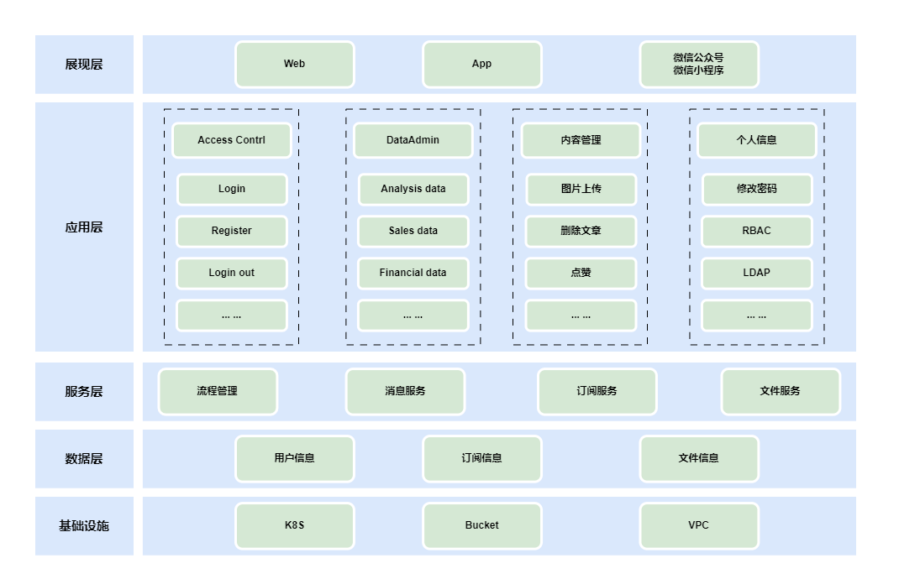
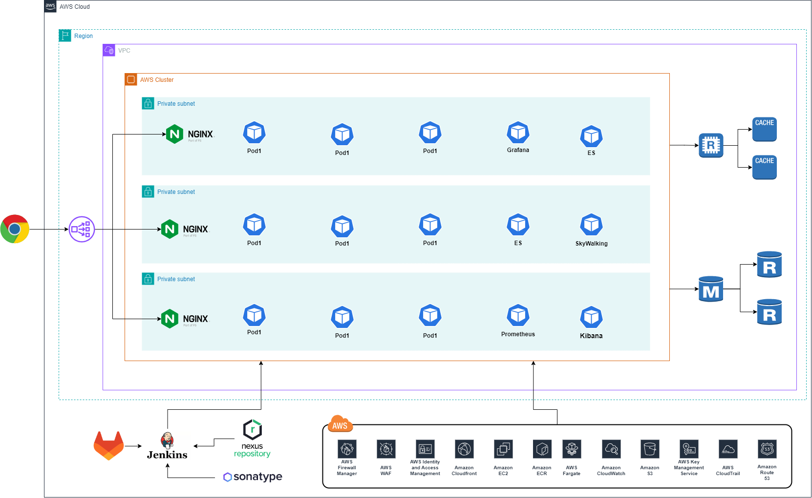

# 本章主要介绍各类架构图

## 系统架构图（System Architecture Diagram）
这种图表显示了整个系统的高层次结构，包括系统的各个组件以及它们之间的关系。系统架构图有助于理解系统的整体设计和功能。

## 软件架构图（Software Architecture Diagram）
这种图表侧重于显示软件系统的组成部分和它们之间的关系。软件架构图可以包括模块、组件、类、对象等元素，以及它们之间的依赖关系。

## 部署架构图（Deployment Architecture Diagram）
包括软件如何在不同服务器、网络和存储设备之间分配和部署，以及如何保证系统的可用性、稳定性和安全性。

## 硬件架构图（Hardware Architecture Diagram）
这种图表展示了系统的硬件组件，如服务器、存储设备、网络设备等，以及它们之间的连接和交互关系。

## 网络架构图（Network Architecture Diagram）
该图表显示了整个网络的布局，包括路由器、交换机、防火墙等网络设备的位置和连接方式。

## 数据架构图（Data Architecture Diagram）
这种图表描述了系统中数据的流动和存储方式，包括数据库、数据仓库、数据流等元素。

## 安全架构图（Security Architecture Diagram） 
该图表重点展示了系统的安全策略和措施，包括身份验证、访问控制、加密等安全方面的组件和关系。

## 流程架构图（Process Architecture Diagram） 
这种图表强调系统中的各种过程、任务和工作流程，显示它们之间的交互和依赖关系。

## 业务架构图（Business Architecture Diagram） 
该图表展示了组织或企业的业务结构，包括业务流程、职能部门、价值流等，帮助理解业务战略和目标。